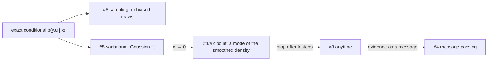

#definition #design

> "Inference" for an implicit diffusion learner is not one map. Listed here are the signatures
> that occur, what each returns, which algorithm computes it, and which ones a
> [[Inversions and Bayesian Lenses|Bayesian lens]] can hold. Short version: there are
> **point**, **anytime**, **distributional** and **message-passing** variants. The original
> sketch's signature $X\times\Theta\times Z\times\hat E_X \to Y\times E\times Z$ is the anytime
> variant with an incoming message.

> Sources: original to this vault (design and analysis); Mardani et al., *A Variational Perspective on Solving Inverse Problems with Diffusion Models*, [arXiv:2305.04391](https://arxiv.org/abs/2305.04391) (RED-Diff); Chung, Kim, McCann, Klasky & Ye, *Diffusion Posterior Sampling for General Noisy Inverse Problems*, ICLR 2023 (DPS); Song et al., [arXiv:2011.13456](https://arxiv.org/abs/2011.13456) (annealed Langevin, probability-flow ODE); Fang, Díaz, Buchanan & Sulam, *Beyond Scores: Proximal Diffusion Models*, [arXiv:2507.08956](https://arxiv.org/abs/2507.08956) (ProxDM); code: `implicit.jl`, `reddiff.jl`, `factor.jl`
>
> Theory (CT-ML wiki): [Bayesian Lens](https://mathstruct.org/CategoryTheory-ML-Wiki/Bayesian-Lens) · [Bayesian Inversion](https://mathstruct.org/CategoryTheory-ML-Wiki/Bayesian-Inversion) · [Statistical Game](https://mathstruct.org/CategoryTheory-ML-Wiki/Statistical-Game) · [Markov Category](https://mathstruct.org/CategoryTheory-ML-Wiki/Markov-Category)

## 1. The ingredients every signature draws from

- **Parameters** $\theta$, the noise predictor's.
- A **polarity**: the precision vector $\rho$, which says which coordinates are inputs $X$, outputs $Y$ and latents $U$ ([[Implicit Diffusion Learners]] §2).
- **Evidence** $z_0$: clamp values on the inputs, and anchors on the anchored outputs.
- An optional **solver state**: a previous $z$, plus the optimiser's moments if one is used.
- An optional **incoming message** on any coordinate: a belief from a neighbouring factor.
- A **noise source**, either a random generator or a fixed node set.

The outputs are an output value or belief on $Y$ (and $U$), a **residual / energy** report, and
an updated state.

## 2. The signatures

| # | name | signature | returns | computed by |
|---|---|---|---|---|
| 1 | point (MAP-like) | $X \times \Theta \to Y$ | a stable root $y^\star$ | `implicit_infer` (deterministic nodes); RED-Diff |
| 2 | point + residual | $X \times \Theta \to Y \times E$ | $y^\star$ and $r(z^\star)$ (or $\mathcal E(z^\star)$) | `implicit_infer` returns `residual`, `converged`, `stable` |
| 3 | anytime, warm-started | $X \times \Theta \times Z \times \mathbb N \to Y \times E \times Z$ | the state after $k$ steps, its residual, the new state | `implicit_infer(…; z_init, maxiters = k)`; RED-Diff with `steps = k` |
| 4 | with incoming message | $\mathcal B(X) \times \Theta \times Z \to Y \times E \times Z$ | as 3, with soft evidence | precisions $\rho$ and anchors $z_0$ encode a Gaussian message |
| 5 | variational | $X \times \Theta \to \mathcal N(Y)$ | mean and covariance | RED-Diff with $\sigma > 0$ (not implemented; [[The Diffusion Factor]] §5) |
| 6 | sampling | $X \times \Theta \times \Omega \to Y$ | one posterior sample | DPS, annealed Langevin, guided reverse SDE |
| 7 | amortised | $X \times \Theta \times \Phi \to Y$ | $h_\varphi(x)$, optionally refined by 3 | a learned initialiser (the `AmortisedInversion` slot) |

**The sketch's signature** $X\times\Theta\times Z\times\hat E_X \to Y\times E\times Z$ is #3 combined
with #4. The state $Z$ is the warm start. $\hat E_X$ is an incoming **message**: the energy a
neighbour assigns to the shared coordinates, here a quadratic, i.e. a precision and a mean, which
enter as $\rho$ and $z_0$. The returned $E$ is the residual or energy report a scheduler needs to
decide whether to keep iterating.

## 3. Which is "the" inference?

None of them alone. In the [[Inversions and Bayesian Lenses|Bayesian-lens]] reading, inference
is the backward map $c'_\pi : Y \to \mathcal P(X)$, which depends on a prior $\pi$. The signatures
are different approximations of the same exact object, the conditional $p_\theta(y, u \mid x)$
of the joint the model represents:

- **Sampling** (#6) is the only signature that represents multimodality. On the circle it returns both branches with the right frequencies; a point method returns the branch whose basin you started in.
- **Point** methods (#1–#4) return a mode of $\Phi + \tfrac12\lVert P(z-z_0)\rVert^2$. That is a *smoothed* posterior mode, and the smoothing bias is computed in [[Implicit Diffusion Learners]] §5.
- **Anytime** (#3) is what message passing actually calls. A factor in a loopy graph is asked for a few steps, then again with new neighbour messages, so its state persists between calls (in `st`).

## 4. The algorithms, sorted by what they compute

| method | target | deterministic? | uses the network | backward pass available |
|---|---|---|---|---|
| RED-Diff (Mardani et al.) | a mode of the smoothed prior, by stochastic descent | no (fresh $t,\varepsilon$ each step) | forward only | only after fixing the nodes (§5) |
| `implicit_infer` (this package) | a stable root of the deterministic field | **yes** | forward, plus input Jacobian | **yes**, by the adjoint |
| noise-free single level | a fixed point of the Tweedie denoiser | yes | forward, plus input Jacobian | yes (it is a DEQ, [[Deterministic Relaxation]]) |
| DPS, ΠGDM | a posterior sample, by guided reverse SDE | no | forward and backward (DPS) | only by differentiating the sampler |
| annealed Langevin | a posterior sample | no | forward | score-function or pathwise estimators |
| ProxDM | a proximal step, by a learned prox network | yes per step | the prox network | yes per step |

Sampling methods are needed when the downstream task needs uncertainty, or when the relation is
multivalued and the branch matters. Point methods are what a factor graph with
[[Messages are Inversions|messages]] can consume today, and what an implicit learner
differentiates through.

## 5. Determinism, and what the noise is

All diffusion-based inference involves noise in two places: the Monte-Carlo estimate of the
expectation over $(t, \varepsilon)$, and, for samplers, the injected noise that makes the output
random. The first is a **numerical** device and can be fixed once (sample-average
approximation: `FieldNodes`). The second is **semantic**: it is what makes the output a sample
rather than a mode.

So "the output is nondeterministic" is true for samplers and for RED-Diff as published. It is
not inherent to the point signature: with fixed nodes, #1–#4 are deterministic functions of
$(z_0, \rho, \theta, z_{\text{init}})$. Determinism is exactly what the implicit function theorem
needs ([[Backpropagation through Implicit Inference]]).

## 6. What the factor graph can hold today

`Mycelium` passes `DiracBelief`s and `GaussianBelief`s. Signatures #1–#4 produce Diracs and
consume Gaussian messages as $(\rho, z_0)$. #5 would produce a Gaussian and fix the problems
listed in [[The Diffusion Factor]] §4. #6 needs a `SampleBelief`, which exists in the core but
which no diffusion factor produces yet.

Related: [[Implicit Diffusion Learners]], [[Backpropagation through Implicit Inference]],
[[Deterministic Relaxation]], [[The Implicit Diffusion Factor as a Statistical Game]],
[[RED-Diff as a Statistical Game]], [[ProxDM and Proximal Alternatives]]
